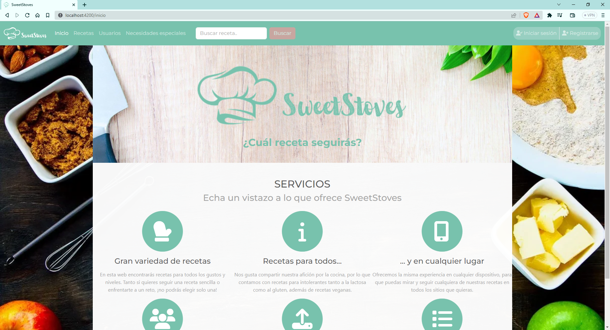
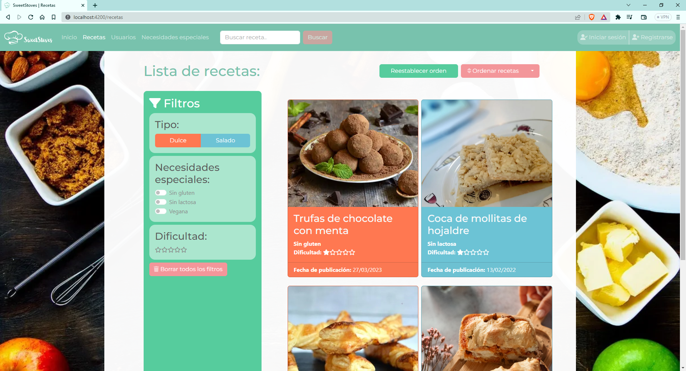
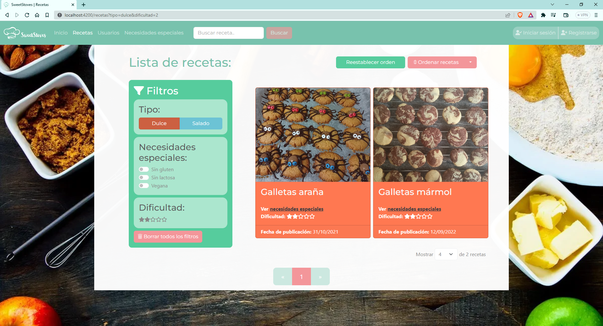
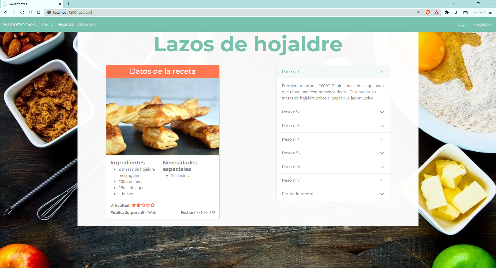
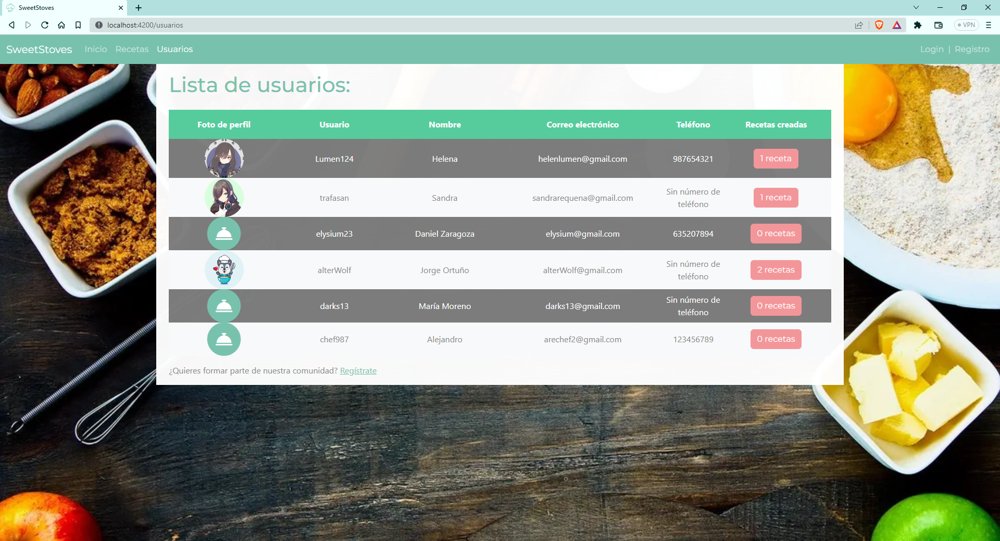
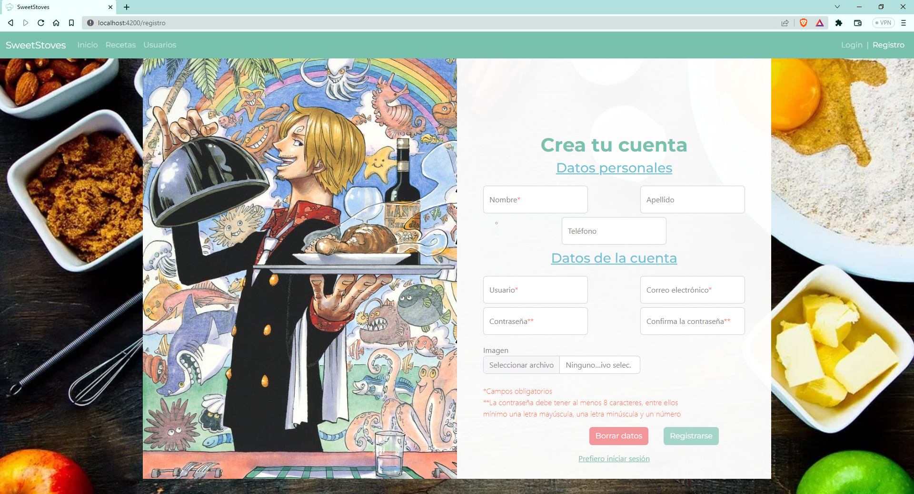
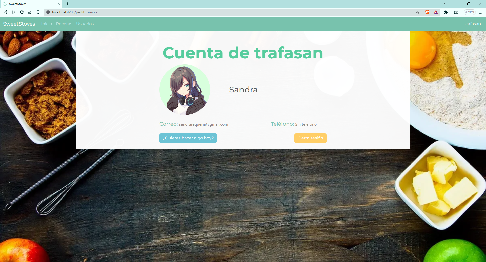
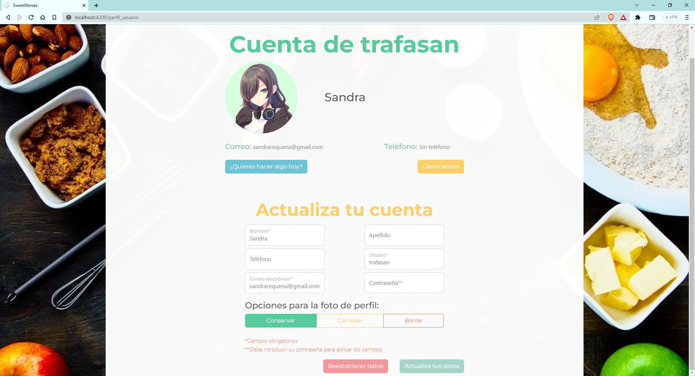

#  SweetStoves
SweetStoves es un blog de recetas en el cual se pueden encontrar diferentes recetas con sus respectivos detalles para que sean fáciles de seguir. Estas recetas han sido publicadas por los usuarios registrados en SweetStoves. Los usuarios de esta web, aparte de poder crear recetas, también pueden marcar recetas de otros usuarios para guardarlas en su lista, gestionar su cuenta y sus recetas. 
En este repositorio encontrarás el código tanto de Back como de Front.
## Backend
La API generada, con enlace *http://localhost:8080/api*, muestra los siguientes recursos:
### Recetas
#### ***Enlaces***
- **/recetas**: Datos de todas las recetas
- **/recetas/id**: Datos de una receta en concreto
#### ___Atributos___
- **id**: Dato numérico que identifica la receta
- **usuario**: El usuario creador de la receta
- **nombre**: Dato de tipo string con el nombre de la receta
- **tipo**: Dato de tipo string. Solo puede ser _dulce_ o _salado_
- **necesidades**: Array de string. Las opciones pueden ser *Sin gluten*, *Sin lactosa* y/o *Vegana*
- **ingredientes**: Array de strings con todos los ingredientes necesarios para elaborar la receta
- **elaboracion**: Array de string con los pasos a seguir para realizar la receta
- **dificultad**: Dato numérico entre el 1 y el 5 que representa la dificultad de la receta
- **imagen**: URL donde se ha guardado la foto de la receta 
- **creacion**: Fecha con formato _yyyy-mm-dd_ de cuando se creó la receta
- **usuarios**: Lista de usuarios que guardaron la receta
### Usuarios
#### ***Enlaces***
- __/usuarios__: Datos de todos los usuarios
- __/usuarios/id__: Datos de un usuario en concreto
#### ___Atributos___
- __id__: Dato numérico que identifica al usuario
- __usuario__: Dato de tipo string con el nombre de usuario
- __correo__: Dato de tipo string con el correo del usuario
- __password__: Dato de tipo string con la contraseña del usuario
- __imagen__: URL donde se ha guardado la foto de perfil del usuario. Este dato puede ser nulo
- __datosUsuario__: Datos personales del usuario (nombre, apellido y teléfono). Todos estos datos son de tipo string y el apellido y el teléfono pueden ser nulos
- __recetas__: Lista de recetas creadas por el usuario
- __recetas_seguidas__: Lista de recetas que ha seguido el usuario
## Frontend
**Para hacer funcionar SweetStoves debes instalar node-modules y jwt-decode.**
Podrás acceder a SweetStoves desde el enlace _http://localhost:4200/_, el cual te redireccionará al menú de inicio.
Sabrás que estás en SweetStoves ya que la web tiene un icono propio en la pestaña del navegador.
### Menú de inicio
En el menú de inicio se pueden consultar los servicios que ofrece esta web. Además, se ha implementado una barra de navegación que aparecerá en todos los enlaces. Por ella se puede navegar a las diferentes rutas de SweetStoves.

### Lista de recetas
Aquí aparecerán todas las recetas creadas por los usuarios de SweetStoves. Las tarjetas de las recetas se han diseñado de tal manera que se reconozcan visualmente las recetas dulces (en naranja) de las recetas saladas (en azul).

Esta lista se puede ordenar por dificultad y por fecha de publicación, tanto ascendente como descendentemente. En el siguiente ejemplo se han ordenado por dificultad de manera descendente.

Además, se puede filtrar de diferentes maneras para que el usuario de la web pueda encontrar la receta que más se ajuste a él en el menor tiempo posible. En el siguiente ejemplo se han utilizado los filtros _Sin lactosa_ y *dificultad 1 de 5*.

### Detalles de la receta
Si se pincha en el título de una de las recetas, se pueden observar los detalles de la misma:

En esta parte se pueden ver los datos de la tarjeta junto con los ingredientes y la elaboración. El menú de la derecha se puede ir desplegando para ir navegando por cada paso. El paso final contiene un botón para volver a la lista de recetas.

### Lista de usuarios
Aquí se pueden ver todos los usuarios registrados en el blog con sus datos. Los usuarios que no tengan foto de perfil tendrán un icono predeterminado (este es el caso del usuario *darks13*). Además, no todos los usuarios han querido poner su número de teléfono, por lo que en la columna del teléfono aparece la frase *Sin número de teléfono* (este es el caso del usuario *alterWolf*).

Por último, la columna de recetas creadas está compuesta por un botón que, al pulsarse, aparece una pestaña que indica la lista de recetas que ha creado el usuario. En la siguiente ilustración se pueden ver ejemplos de los diferentes botones:

### Registro
Se puede acceder a este menú desde la barra de navegación y desde el enlace que se encuentra debajo de la lista de usuarios. También hay un enlace a este menú en el menú de login.

La persona que quiera registrarse en SweetStoves debe rellenar al menos los campos obligatorios. Si los rellena mal, saltarán los errores que haya cometido cuando intente registrarse. Asimismo, no se permitirá el registro de un usuario y/o correo electrónico duplicado. El futuro usuario de la web puede retocar los datos erróneos o borrar los datos del formulario con el botón _Borrar datos_.

    
    

Cuando se envía el formulario correctamente, se redirecciona al usuario al perfil del nuevo usuario.\
Si el usuario ya tiene cuenta en SweetStoves, puede acceder al menú de login con el link llamado _Prefiero iniciar sesión_, el cual se encuentra debajo de los botones anteriormente mencionados.

### Login
Aparte del enlace que se encontraba en el menú anterior, también se puede acceder al menú de login desde la barra de navegación.

Si el usuario pulsa el botón _Iniciar sesión_ y al menos uno de los datos no es correcto, aparecerá una alerta.

 Solo cuando los datos sean válidos, la web le mandará a su menú de usuario. Si el usuario no está registrado, debajo de este botón está el link que redirecciona al menú de registro.

### Menú de usuario
Cuando el usuario ha iniciado sesión, en la barra de navegación aparece su nombre de usuario en vez de los menús de login y registro. Estos solo volverán a aparecen si se cierra la sesión, ya sea porque el usuario pulsa el botón _Cerrar sesión_ o porque han pasado 24 horas desde que la inició.

En este menú, el usuario puede hacer varias tareas que puede elegir en el menú lateral que aparece cuando se pulsa el botón _¿Quieres hacer algo hoy?_

Cuando se mantiene el cursor en uno de los botones, aparece una ventana con una pequeña explicación de la opción y, si se pulsa, debajo de los botones _¿Quieres hacer algo hoy?_ y _Cerrar sesión_ aparece el componente seleccionado:
- Lista de recetas: Esta lista de recetas se diferencia a la lista general en dos detalles:
    1. Solo aparecen las recetas que ha guardado el usuario en cuestión.
    2. Aparece el botón “Borrar receta” en las recetas que ha creado el usuario. Si se borra la receta, desaparecerá del blog.

- Nueva receta: Este formulario solo está disponible para los usuarios de SweetStoves, ya que la receta debe estar vinculada a un usuario. Al igual que los otros formularios, el botón para enviar los datos estará disponible cuando todos los campos obligatorios se rellenen correctamente.

- Actualiza tu cuenta: En este formulario aparecen ya los campos rellenados con los datos actuales del usuario excepto el de la contraseña. Funciona de la misma manera que el formulario de registro en cuanto a errores se refiere. Además, se debe insertar la contraseña actual para poder actualizar los datos correctamente. Nada más enviarlo, los cambios se verán reflejados en el menú de usuario y aparecerá una alerta confirmando que la acción se ha realizado.

- Cambia tu contraseña: Este formulario es específico para actualizar la contraseña. Solo se actualizará cuando la contraseña actual sea la correcta, la nueva contraseña se ajuste al formato y las contraseñas coincidan. Cuando se cumplimente adecuadamente, aparecerá una alerta confirmando que la actualización se ha realizado.

- Borra tu cuenta: En esta última opción el usuario puede borrar su cuenta, aunque también borrará las recetas que ha creado en SweetStoves.

### Otros dispositivos
La experiencia de SweetStoves también se puede vivir en Tablet y en móvil. En este apartado se pueden ver algunos menús en formato Tablet (768x886) y móvil (425x886):
- Menú de inicio:
    

    
    
    

- Lista de recetas:
    

    
    
    

- Lista de usuarios:
    

    
    
    

- Registro:
    

    
    
    

